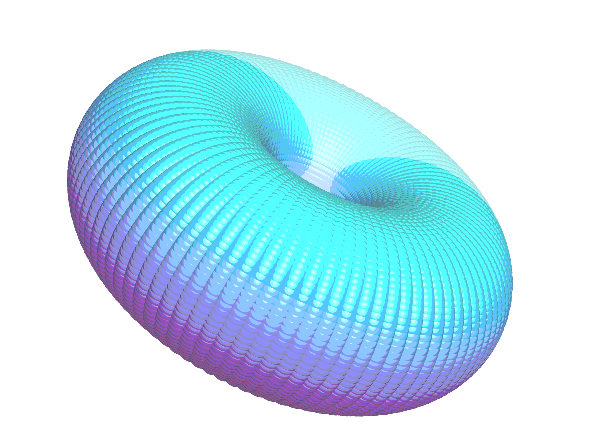
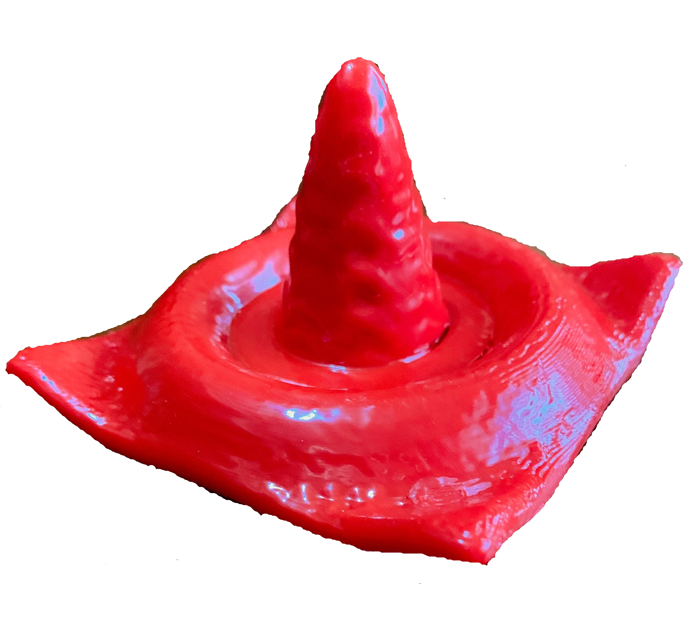
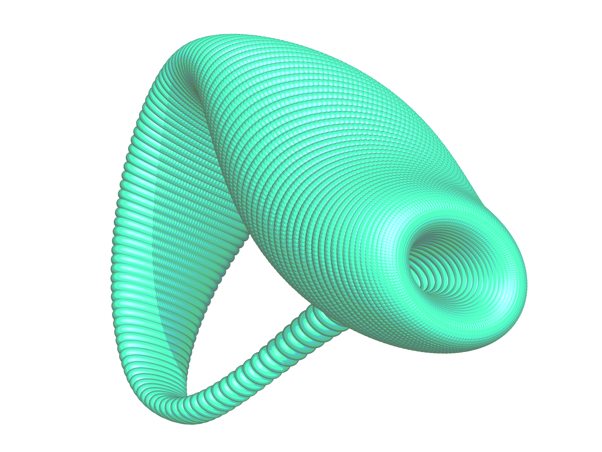
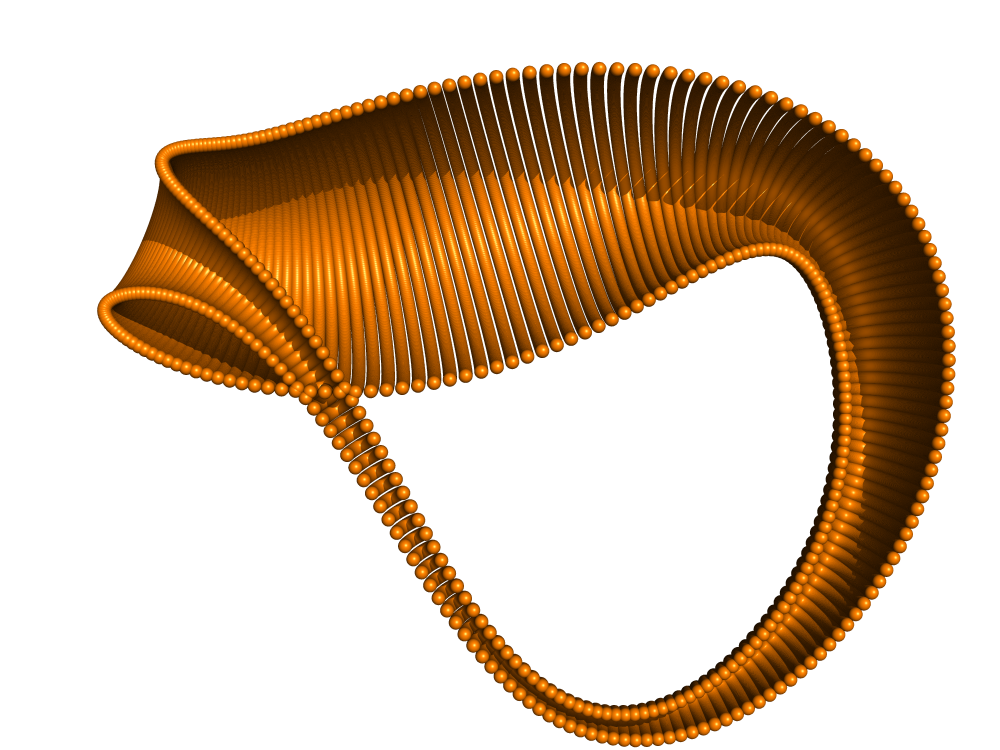
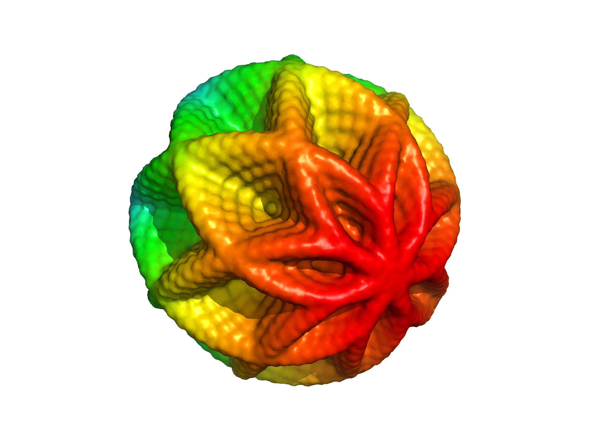
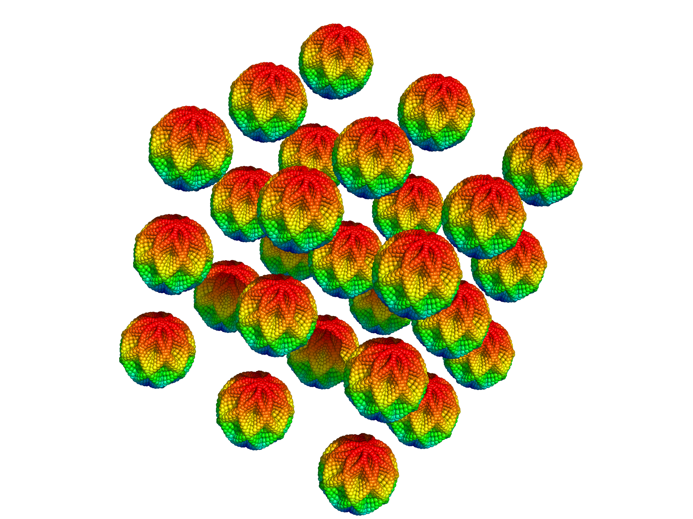

# HowToGraph

## Matplotlib

Basic scripts using matplot to create high quality plots, animations, 3d plots and much more. 

  

  

  

## Pymol

I have written a short script to create 3 dimensional functions and vizualise them using pymol. This can be very useful since all the advantages from pymol can be used on the graphs such as different representations, color (linearly scaled so that 0 is the minimum value) and ray tracing.

For this to work you will need to install pymol:

`sudo apt-get install pymol`
 
 Now you can run the program with your version of python for my case it is:
 
`python3 functiontopymol.py new -1 1 100 80 X**2-Y**2`

  

If everything is correctly installed the program will create a function and open it using pymol if you need a tutorial on how to use pymol you can check this link [Pymol tutorial](https://jamelendezd.github.io/MolecularDynamicsPymol/). The program also creates a colormap of the function and can be open by typing in the terminal:

`pymol colormap.pml`

If you want to try a parametric equation you can run it as follows:

`python3 parametric.py new 0 6.28 0 6.28 100 80 1 '('2+cos'('P')'')'*cos'('T')' '('2+cos'('P')'')'*sin'('T')' sin'('P')'`

  

For information about the parameters you can type `python3 functiontopymol.py -h`. Pymol can also be downloaded in windows however if the path is not correctly set up, the program will still work but you have to open pymol manually and type in the pymol terminal: 

`run function.pml`

Another main advantage of pymol is that you can save the image as a wrl format that can the be converted to .stl using a program such as meshlab, the stl format can then be used to 3d print any function you want. I suggest before creating the wrl file to change the representation to surface and make sure there are no holes you can change the grid and the scale factor to achieve better results. Here are some images generated with this repository including 3d figure printed with Creator Pro.

  
  
  
  

  
  
  
  

  
  

